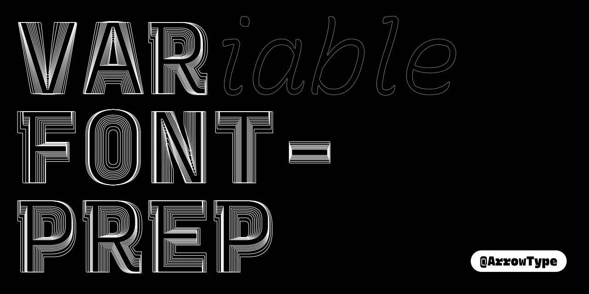
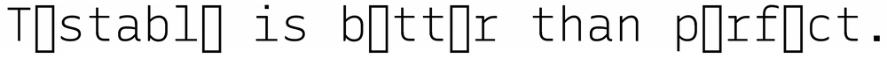

# VarFont Prep

This is a work-in-progress script to prep UFOs for the generation of a variable font ("VF").

A current challenge in making variable fonts from UFOs is that FontMake & FontTools expect all input font masters to be almost perfectly in-sync, without any different or incompatible glyphs. If you have any incompatibility – whether in glyphs, character sets, or even guides, the build will fail. During a design project, this kind of synchrony between several masters is nearly impossible, and certainly a counterproductive thing to focus on (because it prevents rapid exploration within masters).

VarFont Prep seeks to make it easy: it checks UFOs for consistency and compatibility, then outputs new, build-ready UFOs which exclude all non-compatible glyphs. It also outputs a text report to make clear what glyphs were deleted. This is a slightly brute-force approach to the problem, but it allows the type design process to be organic (and therefore productive): exploration can be done on alternate glyphs within each master, without worries about making compatible alternate characters in every other master of the font project. The variable font can be prototyped and tested along the way, with fallback fonts used in proofs where useful. The variable font may have flaws – and that's a good thing! During a design process, *testable* is better than perfect.

**NOTE:** VarFont Prep does not edit the UFOs you select, but rather creates edited copies of these. However, as with any scripting for type design, it is not guaranteed that this workflow is 100% safe to the source fonts. You should always keep backups and use version control to make it simple to revert to earlier versions of the project, in case there are unintended effects on your source files.

## Usage

1. Use `git clone` to download this repo into your RoboFont scripts folder (or download it as a zip).
2. Open RoboFont
3. Run **Scripts > varfont-prep > varfont-prep.py**
   1. This will present a file explorer, allowing you to select the designspace file you want to use for your variable font.
   2. Click "Open"
   3. Wait while the files process. This may take some time, and will make RoboFont temporarily unresponsive.
4. Find the varfont-prep folder, which will be at the same level as the UFOs you selected. It will contain UFOs that are ready (or close to ready) for interpolation.
5. Create or adapt a designspace file to describe the variable font you wish to create.
6. Use [FontMake](https://github.com/googlefonts/fontmake) to generate a variable font: `fontmake -o variable -m [[ PATH/DESIGNSPACE_FILE.designspace ]]`

## Tips

You can make non-exporting glyphs by adding a `_` in front of their names. For instance, I have made the glyph `_arrowhead`, which I use in lots of arrow glyphs, but do not want to export into final fonts. So, Var Font Prep finds and decomposes these components, then deletes the `_arrowhead` glyph.

### Troubleshooting

Likely, FontMake will report that there are incompatible glyphs, witha warning like `cu2qu.errors.IncompatibleFontsError: fonts contains incompatible glyphs: 'a.italic', 'd.italic', 'f.italic', 'g', 'g.italic', 'h.italic', 'i.italic', 'n.italic', 'q', 'r', 'u.italic', 'y', 'z.italic'`. This is useful information! Copy the glyph list output from this error.

1. Go back to RoboFont, and run the script `remove-list-of-glyphs.py` (also in this repo).
2. Paste in the copied list of incompatible glyphs to remove.
3. A file explorer will open. Find the `varfontprep` folder, and select all UFOs within it. This will remove the glyphs that are incompatible. This is a brute-force way to generate a VF for testing, and this is why we're working with duplicates! Obviously, be sure you aren't selecting the actual sources here, or you will need to dig into your backups.

FontMake may report an error connected to your OpenType features, such as `KeyError: ('a.italic', 'SingleSubst[0]', 'Lookup[0]', 'LookupList')`.

1. Use the script `add-feature_code-to-selected_fonts.py` to add (nearly) blank feature code to all selected UFOs. If you prefer, you can edit the feature code in this script to whatever you want as the actual feature code for your output font. However, feature code is often the source of issues in font builds, so only add feature code when you actually want to start testing feature code.

This is very much a work-in-progress set of techniques, and I will add to it more over time.

### Current Limitations

- VarFont Prep is not currently ready to output production-ready font sources. It is a tool for prototyping rather than for mastering release-ready fonts, and the cleanliness of its outputs is very dependant on the cleanliness of the inputs. Of course, this is an advantage: shortcomings of font sources are often easiest to see in an output font.
- Glyphs compatibility is checked with the [isCompatible](https://fontparts.readthedocs.io/en/stable/objectref/objects/glyph.html?highlight=compatible#fontParts.base.BaseGlyph.isCompatible) method of FontParts, which is not as strict as the requirements of the cu2qu module used in the FontMake VF build process. However, if glyphs remain which are incompatible and this blocks the VF build, FontMake tends to output decently-specific warnings about this.
  - When FontMake *does* tell you which glyphs are incompatible, you can either fix them in the original files, then run VarFont Prep again, *or* you can run `remove-list-of-glyphs.py` on the UFOs in the next folder or prepped UFOs. Obviously, be sure not to run this on your source font files.
- This doesn't check and remove all possible incompatibilities from sources. Areas that aren't currently covered are kerning and anchors.
- Sometimes, the `/space` glyph is deleted in the prepped UFOs (though, I haven't experience this issue recently, so it may be solved – I need to verify). If the `/space` glyph is missing, this is patched by re-adding it and giving it a width of `600` units. This is unintended behavior, but shouldn't affect you if you have a `/space` glyph in all sources (as you probably do). This issue may occur with other empty glyphs as well. Please file an issue if you find this happening.

## Needs

- Refactoring for performance. Currently, this opens and closes font files multiple times, which is wasteful and most likely slows down processing substantially.
- Probably, run `cu2qu -i` to pre-convert to TTF. This will provide a more-accurate view of what can and cannot convert. 
- Instead of removing unsupported glyphs, there should be the option to fill them in from the next-closest master. E.G. ExtraBold Italic glyphs could fill in for missing glyphs in Heavy Italic.
  - (how would this detect the next-closest master? with the designspace?)
- Can this run as an external script, instead of being tied to RoboFont?
